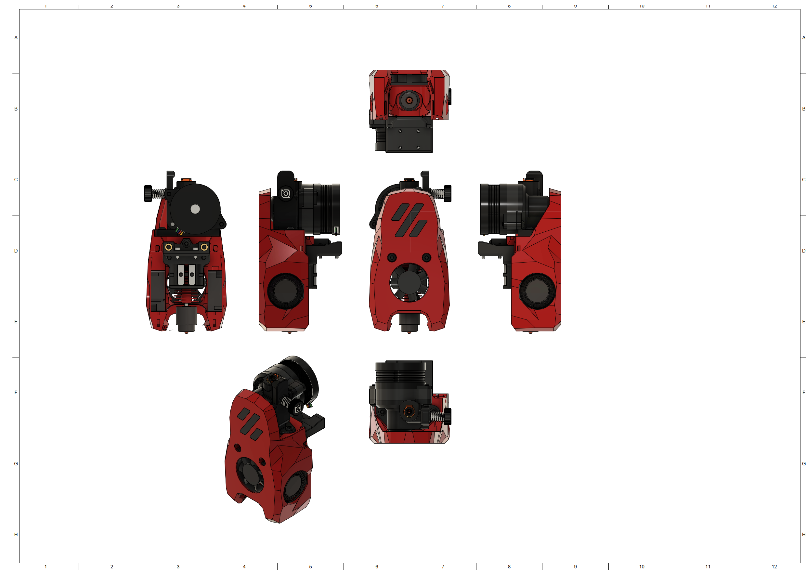
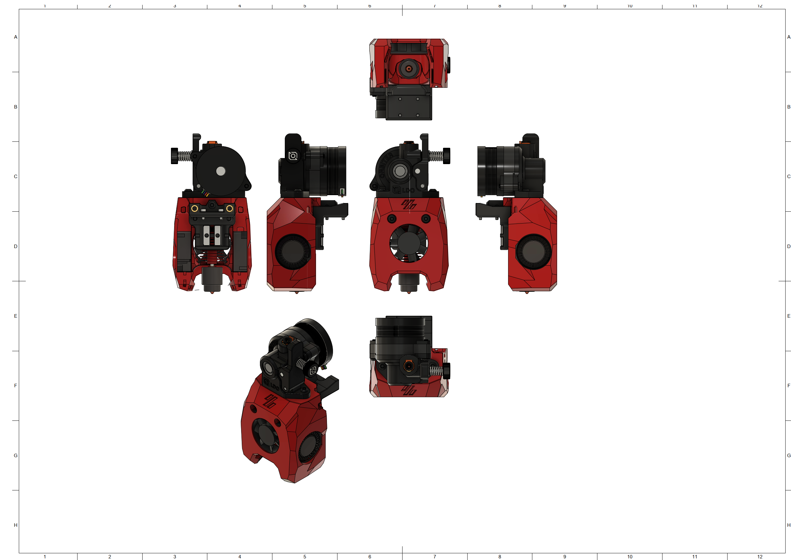

# MiniSB Orbiter v2.0
## Versions
There are two Versions: The CAD-Version has the exact Mounting-Hole spacing from the Orbiter-CAD-File. The Offset-Version has the left Mounting-Hole moved 0.4mm outside, because the Orbiter v2.0 that i have has a 0.4mm offset Mounting-Hole from the CAD. To check which version you need use some calipers and measure the shortest distance of the Mounting-Holes: 33.80mm -> CAD-Version, 34.20mm -> Offset Version.
## BOM
| Part                         | Quantity | Usage                                                        |
|------------------------------|----------|--------------------------------------------------------------|
| M3x5x4 Heatset Insert        | 6        | Cowling & Strain-Relief Spacers                              |
| M3x8 BHCS                    | 4        | Orbiter to Cowling & Strain-Relief to X-Carriage                                  |
| M3x6 BHCS                    | 2        | Strain-Relief to Spacers                                     |
|                              |          |                                                              |
| **For Standard-Strain-Relief:**  |          |                                                              |
| -                            |          |                                                              |
|                              |          |                                                              |
| **For Alternate-Strain-Relief:** |          |                                                              |
| -                            |          |                                                              |
|                              |          |                                                              |
| **For Umbilical-PCB:**           |          |                                                              |
| M3x6 BHCS                    | 2        | Umbilical PCB to Mounting Plate                              |
## Spacer Sizes
| Variant | LDO-Motor | MOONS-Motor |
|---------|-----|-------|
| Standard | 2x [18.10mm](/Spacers/Octagon-STL/Octagon_Spacer_18.10mm.stl) | 2x [17.60mm](/Spacers/Octagon-STL/Octagon_Spacer_17.60mm.stl) |
| Alternative | 2x [18.10mm](/Spacers/Octagon-STL/Octagon_Spacer_18.10mm.stl) | 2x [17.60mm](/Spacers/Octagon-STL/Octagon_Spacer_17.60mm.stl) |
| Umbilical-PCB | 2x [18.10mm](/Spacers/Octagon-STL/Octagon_Spacer_18.10mm.stl) | 2x [17.60mm](/Spacers/Octagon-STL/Octagon_Spacer_17.60mm.stl) |
## Images
### Standard

### Minified

