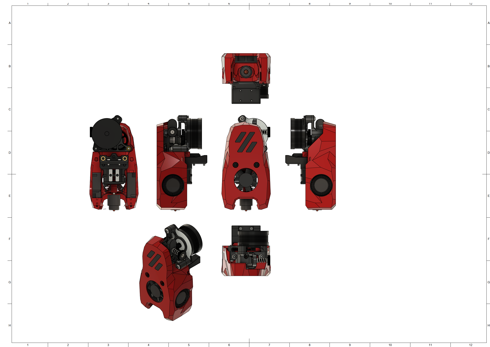
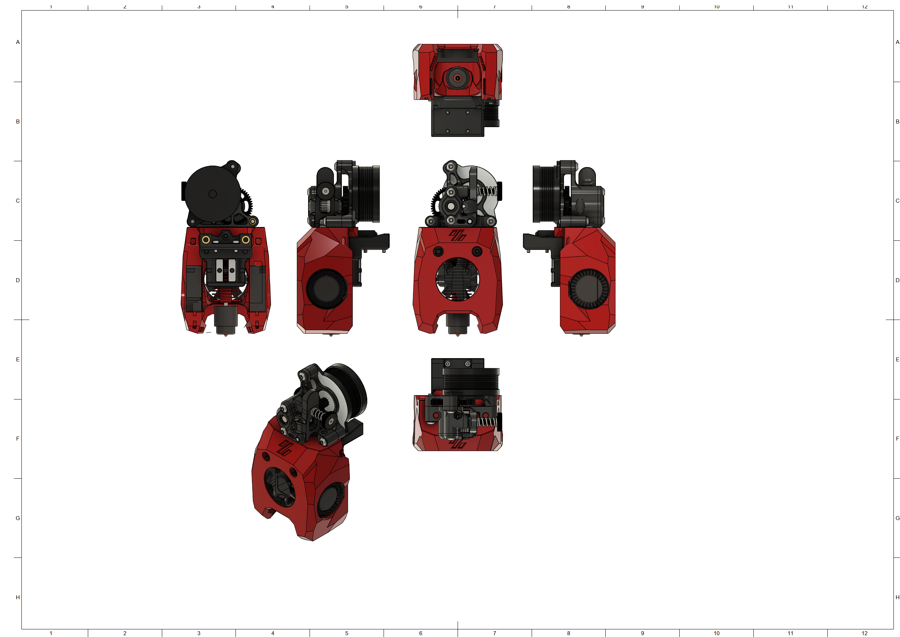

# MiniSB Sherpa Micro
## BOM
| Part                         | Quantity | Usage                                                        |
|------------------------------|----------|--------------------------------------------------------------|
| M3x5x4 Heatset Insert        | 6        | Cowling & Strain-Relief Spacers                              |
| M3x25 BHCS | 1 | Replace Motor Screws for more Thread for the Spacers to engage with |
| M3x12 BHCS                   | 2        | Sherpa Micro to Cowling |
| M3x8 BHCS                    | 2        | Strain-Relief to X-Carriage                                  |
| M3x6 BHCS                    | 2        | Strain-Relief to Spacers                                     |
|                              |          |                                                              |
| **For Standard-Strain-Relief:**  |          |                                                              |
| M3x25 BHCS                            |   1       |  Replace Screws for more Thread for the Spacers to engage with                                                            |
|                              |          |                                                              |
| **For Alternate-Strain-Relief:** |          |                                                              |
| M3x16 BHCS                            |   1       |    Replace Screws for more Thread for the Spacers to engage with                                                          |
|                              |          |                                                              |
| **For Umbilical-PCB:**           |          |                                                              |
| M3x16 BHCS | 1 | Replace Motor Screws for more Thread for the Spacers to engage with |
| M3x6 BHCS                    | 2        | Umbilical PCB to Mounting Plate                              |
## Spacer Sizes
| Variant | LDO-Motor | MOONS-Motor |
|---------|-----|-------|
| Standard | 1x 21.85mm, 1x 23.85 | 1x 21.35mm, 1x 23.85mm |
| Alternative | 2x 21.85mm | 2x 21.35mm |
| Umbilical-PCB | 2x 21.85mm | 2x 21.35mm |
## Images
### Standard

### Minified

