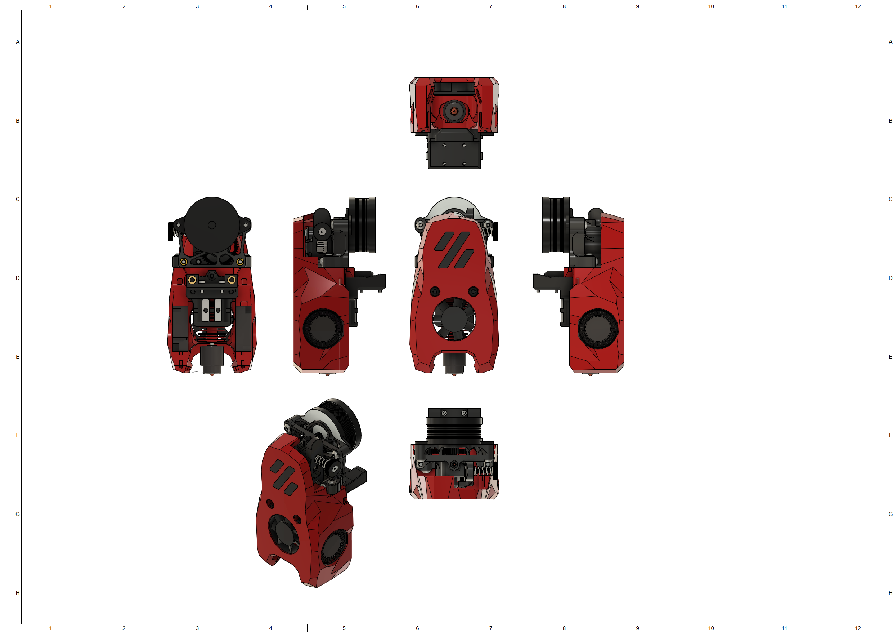
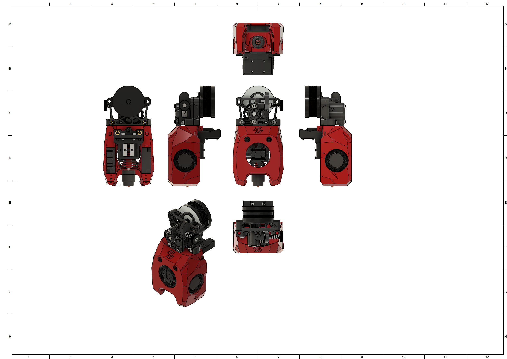

# MiniSB Sherpa Mini
## BOM
| Part                         | Quantity | Usage                                                        |
|------------------------------|----------|--------------------------------------------------------------|
| M3x5x4 Heatset Insert        | 6        | Cowling & Strain-Relief Spacers                              |
| M3x16 BHCS | 2 | Replace Motor Mount Screws |
| M3x12 BHCS                   | 2        | Sherpa Mini to Cowling |
| M3x8 BHCS                    | 2        | Strain-Relief to X-Carriage                                  |
| M3x6 BHCS                    | 2        | Strain-Relief to Spacers                                     |
|                              |          |                                                              |
| **For Standard-Strain-Relief:**  |          |                                                              |
| -                            |          |                                                              |
|                              |          |                                                              |
| **For Alternate-Strain-Relief:** |          |                                                              |
| -                            |          |                                                              |
|                              |          |                                                              |
| **For Umbilical-PCB:**           |          |                                                              |
| M3x6 BHCS                    | 2        | Umbilical PCB to Mounting Plate                              |
## Spacer Sizes
| Variant | LDO-Motor | MOONS-Motor |
|---------|-----|-------|
| Standard | 2x 21.85mm | 2x 21.35mm |
| Alternative | 2x 21.85mm | 2x 21.35mm |
| Umbilical-PCB | 2x 21.85mm | 2x 21.35mm |
## Images
### Standard

### Minified

