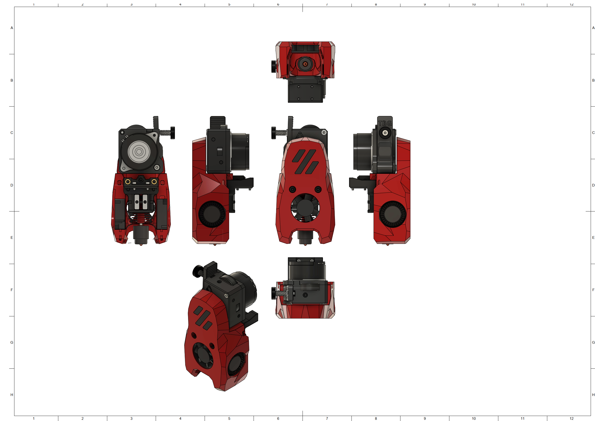
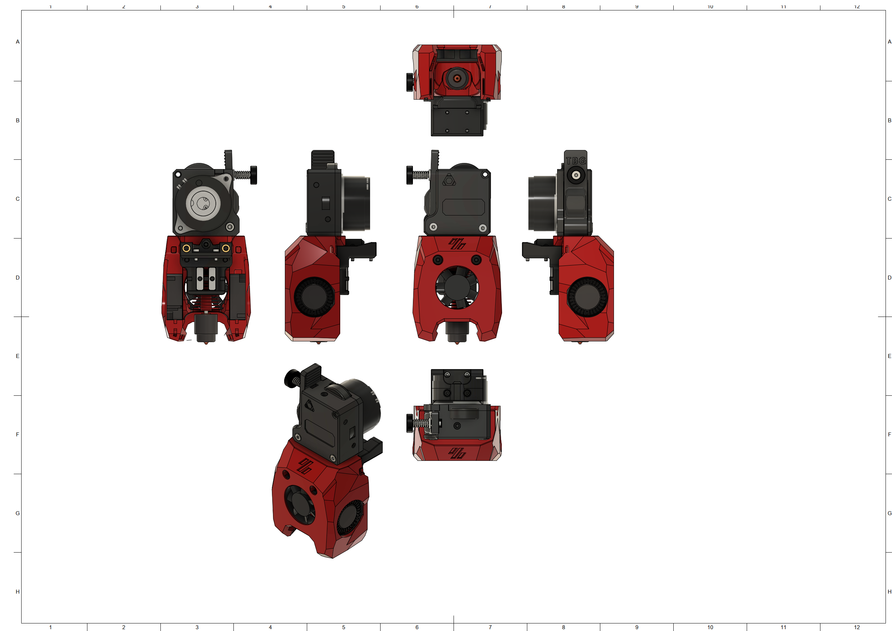

# MiniSB TBG-Lite Left
## PTFE-Holder
The TBG-Lite doesn't hold a PTFE-Reverse Bowden tube by itself, for this the PTFE-Holder is included. Mount by removing the top-right Screw and pushing on the PTFE-Holder and then securing it with a M3x30 BHCS.

The orientation in which the PTFE-Holder is printed makes it crucial that you have good layer adhesion. If you have issues with the part breaking during installation try printing it rotated by 90°, so the PTFE-Hole is at the top and the mounting holes at the bottom.
## BOM
| Part                         | Quantity | Usage                                                        |
|------------------------------|----------|--------------------------------------------------------------|
| M3x5x4 Heatset Insert        | 4        | Strain-Relief Spacers                              |
| M3x30 BHCS | 1 | Replace Screw for PTFE-Holder |
| M3x12 BHCS                   | 3        | TGB-Lite to Cowling |
| M3x8 BHCS                    | 2        | Strain-Relief to X-Carriage                                  |
| M3x6 BHCS                    | 2        | Strain-Relief to Spacers                                     |
| M3x8 FHCS | 1 | Replace Top Motor Screw for Spacers |
|                              |          |                                                              |
| **For Standard-Strain-Relief:**  |          |                                                              |
| M3x25 BHCS                            |   1      |       Replace Bottom Motor Screw for Spacers                                                       |
|                              |          |                                                              |
| **For Alternate-Strain-Relief:** |          |                                                              |
| -                            |          |                                                              |
|                              |          |                                                              |
| **For Umbilical-PCB:**           |          |                                                              |
| M3x6 BHCS                    | 2        | Umbilical PCB to Mounting Plate                              |
## Spacer Sizes
| Strain-Relief Style | LDO-Motor | MOONS-Motor |
|---------|-----|-------|
| Standard | 2x [22.35mm](/Spacers/Octagon-STL/Octagon_Spacer_22.35mm.stl) | 2x [21.85mm](/Spacers/Octagon-STL/Octagon_Spacer_21.85mm.stl) |
| Alternative | 1x [20.35mm](/Spacers/Octagon-STL/Octagon_Spacer_20.35mm.stl), 1x [22.35mm](/Spacers/Octagon-STL/Octagon_Spacer_22.35mm.stl) | 1x [20.35mm](/Spacers/Octagon-STL/Octagon_Spacer_20.35mm.stl), 1x [21.85mm](/Spacers/Octagon-STL/Octagon_Spacer_21.85mm.stl) |
| Umbilical-PCB | 1x [20.35mm](/Spacers/Octagon-STL/Octagon_Spacer_20.35mm.stl), 1x [22.35mm](/Spacers/Octagon-STL/Octagon_Spacer_22.35mm.stl) | 1x [20.35mm](/Spacers/Octagon-STL/Octagon_Spacer_20.35mm.stl), 1x [21.85mm](/Spacers/Octagon-STL/Octagon_Spacer_21.85mm.stl) |
## Images
### Standard

### Minified

