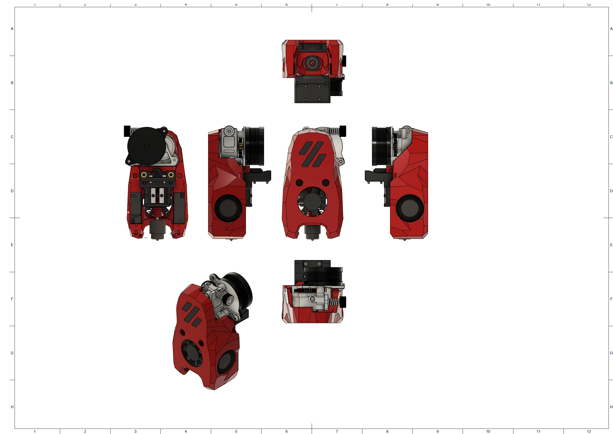
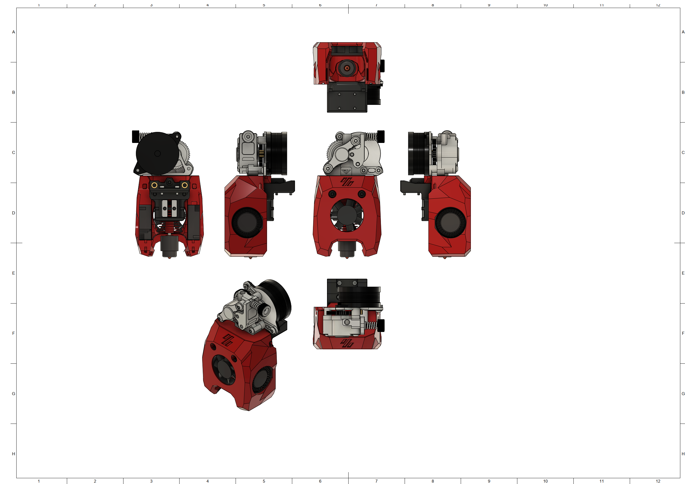

# MiniSB Vz-Hextrudort Low
## BOM
| Part                         | Quantity | Usage                                                        |
|------------------------------|----------|--------------------------------------------------------------|
| M3x5x4 Heatset Insert        | 4        | Strain-Relief Spacers                              |
| M3x12 BHCS                   | 2        | Vz-Hextrudort to Cowling |
| M3x8 BHCS                    | 2        | Strain-Relief to X-Carriage                                  |
| M3x6 BHCS                    | 2        | Strain-Relief to Spacers                                     |
|                              |          |                                                              |
| **For Standard-Strain-Relief:**  |          |                                                              |
| -                            |          |                                                              |
|                              |          |                                                              |
| **For Alternate-Strain-Relief:** |          |                                                              |
| -                            |          |                                                              |
|                              |          |                                                              |
| **For Umbilical-PCB:**           |          |                                                              |
| M3x6 BHCS                    | 2        | Umbilical PCB to Mounting Plate                              |
## Spacer Sizes
| Variant | LDO-Motor | MOONS-Motor |
|---------|-----|-------|
| Standard | 2x 22.20mm | 2x 21.70mm |
| Alternative | 2x 22.20mm | 2x 21.70mm |
| Umbilical-PCB | 2x 22.20mm | 2x 21.70mm |
## Images
### Standard

### Minified

