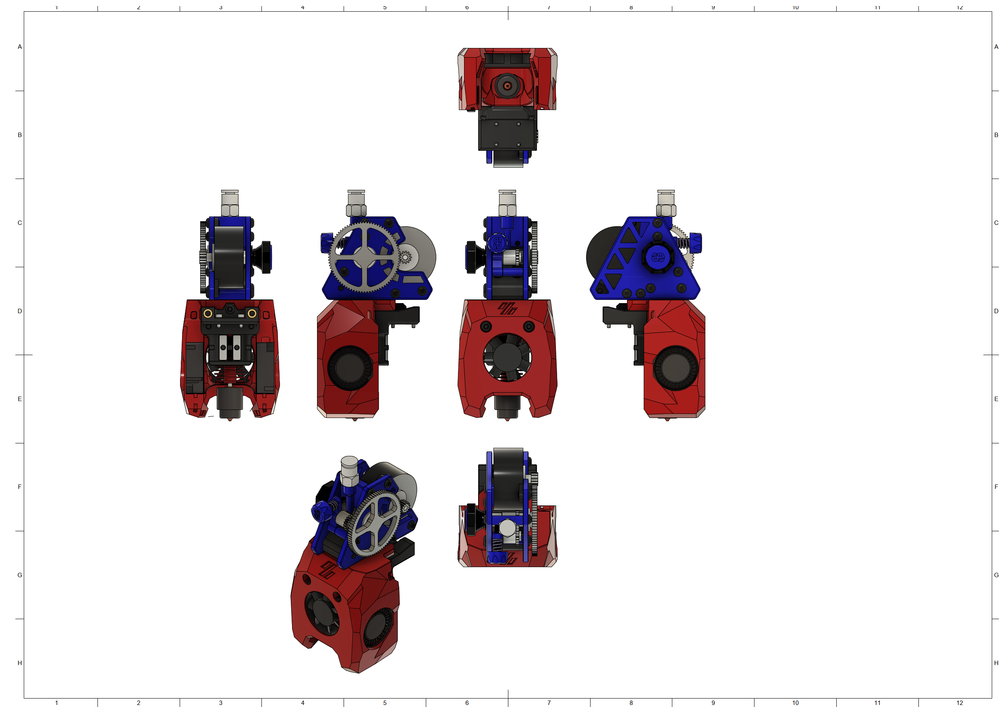

# MiniSB Apus Extruder Experimental

Because of the unique Shape of the Apus-Extruder there is only a Minified Version and one Strain-Relief. You'll also need the print the Apus-Adapter to mount the Extruder to the Cowling.

## BOM
[General BOM](/README.md#general-bom) and following parts are needed
| Part                             | Quantity | Usage                       |
| -------------------------------- | -------- | --------------------------- |
| M3x5x4 Heatset Insert            | 4        | Cowling                     |
| M3x12 BHCS                       | 4        | Apus to Cowling             |
| M3x8 BHCS                        | 2        | Strain-Relief to X-Carriage |
|                                  |          |                             |
| **For Standard-Strain-Relief:**  |          |                             |
| M3x8 BHCS                        | 1        | Replace Motor Screw         |
|                                  |          |                             |
| **For Alternate-Strain-Relief:** |          |                             |
| -                                |          |                             |
|                                  |          |                             |
| **For Umbilical-PCB:**           |          |                             |
| M3x6 BHCS | 6 | X-Carriage Spacers, Umbilical-PCB, umbilical-plate to Top Spacers |

## Spacer Sizes

| Strain-Relief Style | LDO-Motor | MOONS-Motor |
| ------------------- | --------- | ----------- |
| Standard            | -         | -           |
| Alternative         | -         | -           |
| Umbilical-PCB       | -         | -           |

## Assembly
1. Install the 4 Heatsets into the Cowling
2. Install the Apus-Adapter printed part onto the Cowling and secure it with then 4 M3x12 BHCS into the Heatsets in the Cowling
3. Install the Fans and the Hotend
4. Install to the X-Carriage
5. Add strain-relief/umbilical

## Images

### Minified

