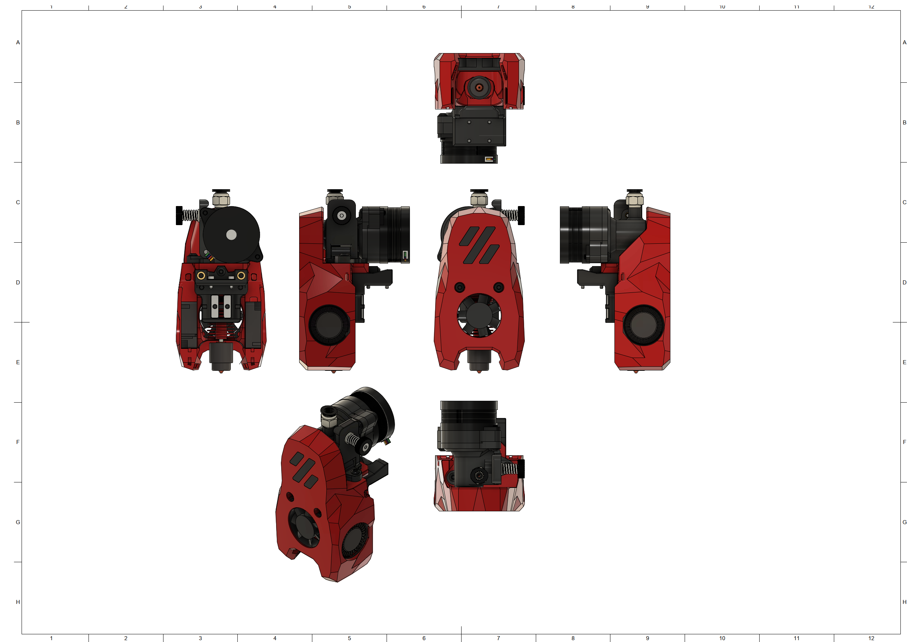
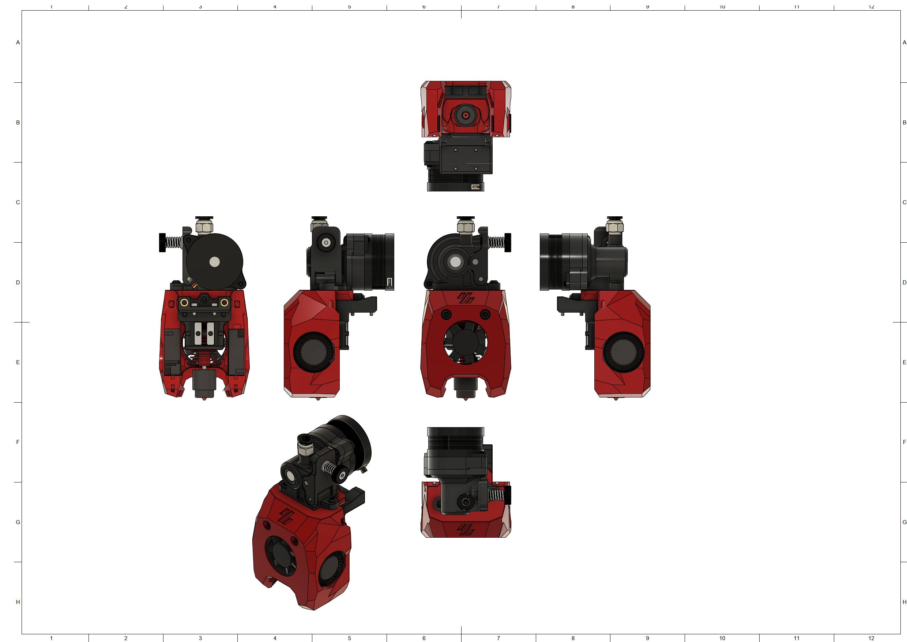

# MiniSB Orbiter v1.5 Experimental

Because of the length of the Orbiter v1.5 there are some challenges with this design, including Strain-Reliefs and potential Space constraints within a V0. Because of these untested issues it is marked as an experimental release. Use with caution.

## BOM
[General BOM](/README.md#general-bom) and following parts are needed
| Part                             | Quantity | Usage                                                          |
| -------------------------------- | -------- | -------------------------------------------------------------- |
| M3x5x4 Heatset Insert            | 6        | Cowling & Strain-Relief Spacers                                |
| M3x16 BHCS                       | 2        | Replace motor mount screws                                     |
| M3x8 BHCS                        | 4        | Orbiter to Cowling & Strain-Relief to X-Carriage               |
| M3x6 BHCS                        | 2        | Strain-Relief to Spacers                                       |
|                                  |          |                                                                |
| **For Standard-Strain-Relief:**  |          |                                                                |
| -                                |          |                                                                |
|                                  |          |                                                                |
| **For Alternate-Strain-Relief:** |          |                                                                |
| M3x5x4 Heatset Insert            | 2        | Bottom Spacers                                                 |
| M3x6 BHCS                        | 2        | Bottom Spacers to X-Carriage                                   |
|                                  |          |                                                                |
| **For Umbilical-PCB:**           |          |                                                                |
| M3x5x4 Heatset Insert            | 2        | Bottom Spacers                                                 |
| M3x6 BHCS                        | 4        | Umbilical PCB to Mounting Plate & Bottom Spacers to X-Carriage |

## Spacer Sizes

| Strain-Relief Style | LDO-Motor                                                     | MOONS-Motor                                                   |
| ------------------- | ------------------------------------------------------------- | ------------------------------------------------------------- |
| Standard            | 1x [23.10mm](/Spacers/Octagon-STL/Octagon_Spacer_23.10mm.stl), 1x [10.80mm](/Spacers/Octagon-STL/Octagon_Spacer_10.80mm.stl) | 1x [22.60mm](/Spacers/Octagon-STL/Octagon_Spacer_22.60mm.stl), 1x [10.30mm](/Spacers/Octagon-STL/Octagon_Spacer_10.30mm.stl) |
| Alternative         | 2x [17.60mm](/Spacers/Octagon-STL/Octagon_Spacer_17.60mm.stl) | 2x [17.10mm](/Spacers/Octagon-STL/Octagon_Spacer_17.10mm.stl) |
| Umbilical-PCB       | 2x [17.60mm](/Spacers/Octagon-STL/Octagon_Spacer_17.60mm.stl) | 2x [17.10mm](/Spacers/Octagon-STL/Octagon_Spacer_17.10mm.stl) |

## Images

### Standard

### Minified

