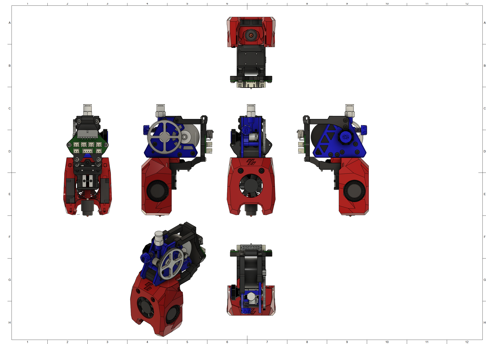

# MiniSB Apus Extruder - Untested
Because of the unique Shape of the Apus-Extruder there is only a Minified Version.

This Mount has not been tested in an actual printer, however outside everything fits fine. So double check that your wiring doesn't hit anything in the back of the printer.

## BOM

| Part                                   | Quantity | Notes                                                                      |
| -------------------------------------- | -------- | -------------------------------------------------------------------------- |
| M3x5x4 Heatset                         | 8        |                                                                            |
| M3x4.2x3 Heatset                       | 2        | Only needed when using printed Apus-Adapter piece                          |
| M3x35 BHCS                             | 2        |                                                                            |
| M3x22 BHCS                             | 1        | M3x25 + M3 Washer also works                                               |
| M3x12 BHCS                             | 4        | Should be included with the Apus Extruder                                  |
| M3x8 BHCS                              | 2        |                                                                            |
| M3x6 BHCS                              | 4        |
| M3 Hexnut                              | 1        |
| 3010 Axial Fan                         | 1        |
| 3010 Blower Fan                        | 2        |
| Hotend                                 | 1        | There are a number of supported Hotends, check the V0.2 GitHub for options |
| Apus Extruder                          | 1        |
|                                        |          |                                                                            |
| **Additional Parts for Umbilical PCB** |
| M3x6 BHCS                              | 6        | X-Carriage Spacers, Umbilical-PCB, umbilical-plate to Top Spacers          |

## Images

### Minified

