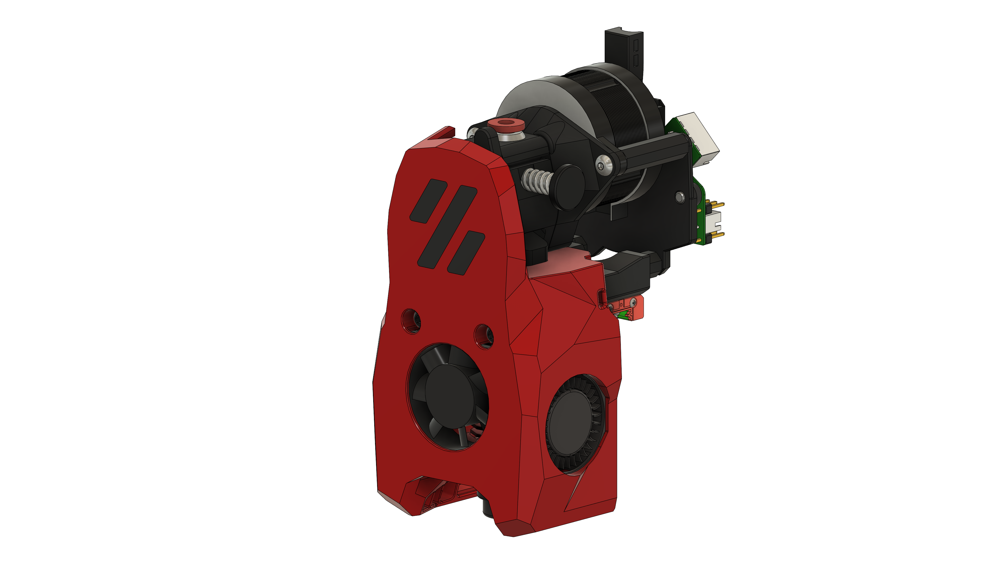
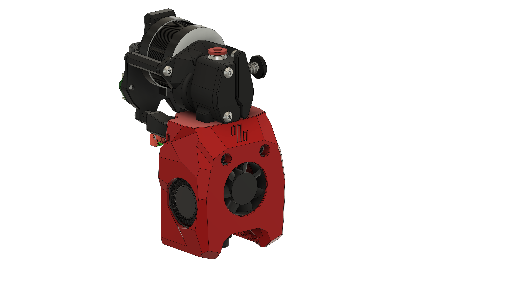

# MiniSB Lerdge Aquarius

## About the Stock Motor

It seems like at some point the stock motor that can be bought with this Extruder changed.
In the CAD and on most product pages the motor is 25.5 mm long. However, some units are only 22 mm long.
If you received one of the shorter motors you might be able to use the MOONS spacers and no bottom spacers for the strain relief. If you have the longer motor you will need the bottom spacer and `Stock_Motor` Spacers.

## BOM

| Part                                                                      | Quantity | Notes                                                                      |
| ------------------------------------------------------------------------- | -------- | -------------------------------------------------------------------------- |
| M3x5x4 Heatset Insert                                                     | 4        |
| M3x35 BHCS                                                                | 2        |                                                                            |
| M3x20 BHCS                                                                | 1        |
| M3x6 BHCS                                                                 | 2        |
| M3x8 FHCS                                                                 | 2        | Should be included with the extruder                                       |
| M3 Hex nut                                                                | 1        |
| 3010 Axial Fan                                                            | 1        |
| 3010 Blower Fan                                                           | 2        |
| Hotend                                                                    | 1        | There are a number of supported Hotends, check the V0.2 GitHub for options |
| Lerdge Aquarius Extruder                                                  | 1        |
|                                                                           |          |                                                                            |
| **Additional Parts required when using the stock motor (> 21 mm length)** |
| M3x12 BHCS                                                                | 2        |
| **Additional Parts for standard strain relief**                           |
| M3x8 BHCS                                                                 | 2        | Only for shorter motors                                                    |
| **Additional Parts for Umbilical PCB**                                    |
| M3x8 BHCS                                                                 | 2        | Only for shorter motors                                                    |
| M3x6 BHCS                                                                 | 2        |                                                                            |
| **Additional Parts for CAN Toolheads**                                    |
| M3x6 BHCS                                                                 | 2        |
| M3x6 BHCS                                                                 | 2        | Only for shorter motors                                                    |

## Printed Parts

- 1x Hotend Mount
- 1x Cowling of your choice
- 1x Strain Relief Plate for your wiring setup (CAN, Timmit Umbilical or stock)
- 2x Spacer Octagon or Round according to your used motor
- 1x PTFE-Guide

If you are using a motor which is longer than 21 mm, like the stock motor sold as an option with this extruder, you will need to print the plates and spacers marked `Stock_Motor`.

## Images

### Standard

### Minified

## CAD-Source

The CAD-File of the extruder was provided by Lerdge upon request.
