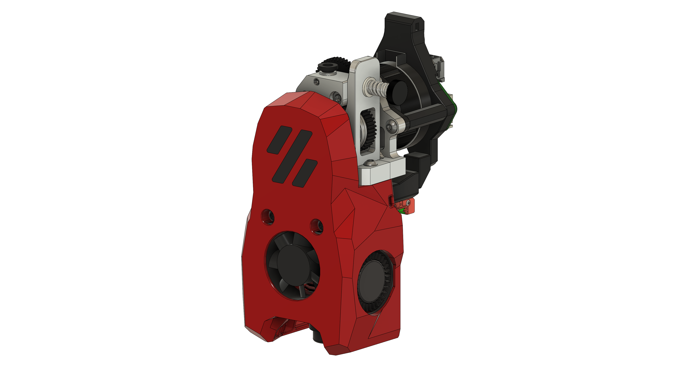
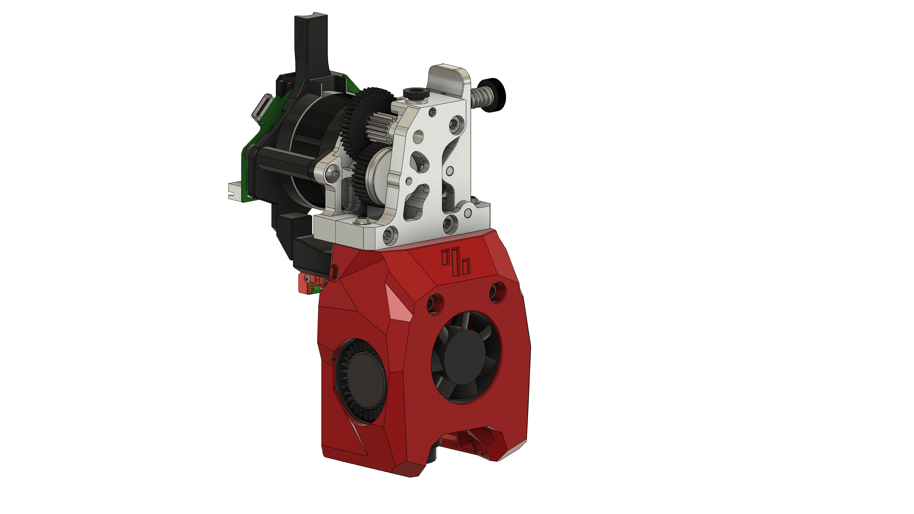

# MiniSB HGX Lite

## BOM

| Part                                            | Quantity | Notes                                                                      |
| ----------------------------------------------- | -------- | -------------------------------------------------------------------------- |
| M3x5x4 Heatset Insert                           | 6        |
| M3x35 BHCS                                      | 2        |                                                                            |
| M3x20 BHCS                                      | 1        |                                                                            |
| M3x12 BHCS                                      | 2        | Should be included with the HGX Lite Extruder                              |
| M3x6 BHCS                                       | 2        |
| M3 Hex nut                                      | 1        |
| 3010 Axial Fan                                  | 1        |
| 3010 Blower Fan                                 | 2        |
| Hotend                                          | 1        | There are a number of supported Hotends, check the V0.2 GitHub for options |
| HGX Lite Extruder                               | 1        |
|                                                 |          |                                                                            |
| **Additional Parts when using the Stock Motor** |
| M3x5x4 Heatset Insert                           | 2        |
| **Additional Parts for standard strain relief** |
| M3x8 BHCS                                       | 2        |                                                                            |
| M3x6 BHCS                                       | 2        | For Stock Motor                                                            |
| **Additional Parts for Umbilical PCB**          |
| M3x8 BHCS                                       | 2        |                                                                            |
| M3x6 BHCS                                       | 2        | For shorter motors                                                         |
| M3x10 BHCS                                      | 2        | For stock motor                                                            |
| **Additional Parts for CAN Toolheads**          |
| M3x6 BHCS                                       | 2        |                                                                            |
| M3x6 BHCS                                       | 2        | For shorter motors                                                         |
| M3x10 BHCS                                      | 2        | For stock motor                                                            |

## Images

### Standard

### Minified

## CAD-Source

The Extruder CAD-Model is based on the [HGX LITE to SV06 mod by Gumo Design](https://www.printables.com/en/model/556167-hgx-lite-to-sv06-mod/files)
