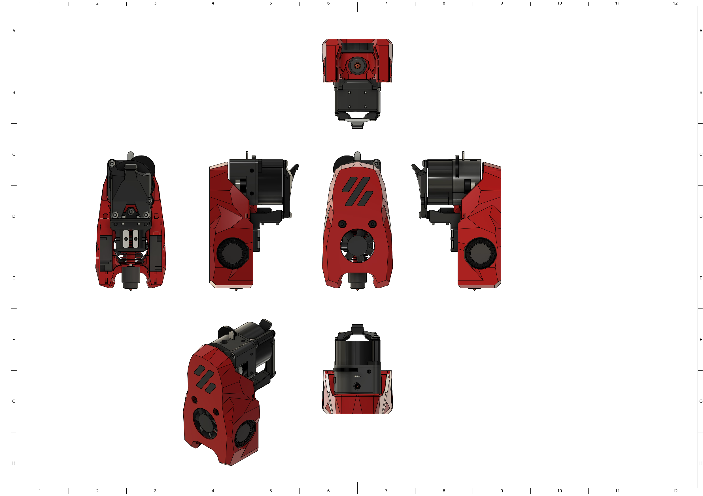
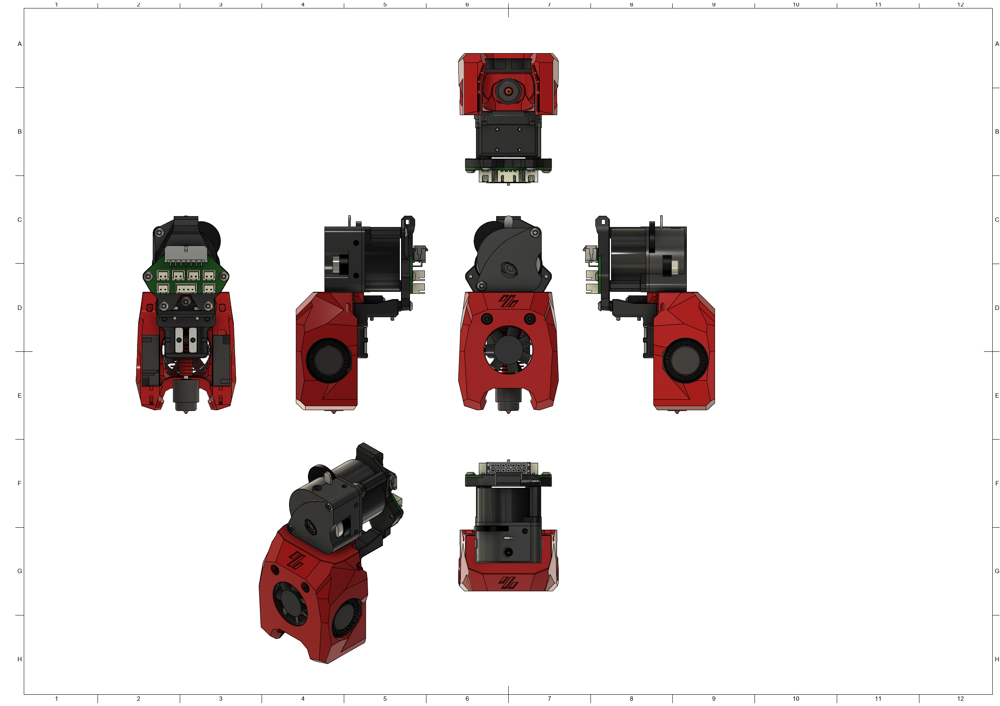

# MiniSB LGX Lite

## BOM

| Part                                            | Quantity | Notes                                                                      |
| ----------------------------------------------- | -------- | -------------------------------------------------------------------------- |
| M3x5x4 Heatset Insert                           | 4        |
| M3x35 BHCS                                      | 2        |                                                                            |
| M3x30 BHCS                                      | 2        | Optional to replace Motor Screws                                           |
| M3x20 BHCS                                      | 1        |                                                                            |
| M3x8 BHCS                                       | 4        |
| M3x6 BHCS                                       | 2        |
| M3 Hexnut                                       | 1        |
| 3010 Axial Fan                                  | 1        |
| 3010 Blower Fan                                 | 2        |
| Hotend                                          | 1        | There are a number of supported Hotends, check the V0.2 GitHub for options |
| Bondtech LGX-Lite Extruder                      | 1        |
|                                                 |          |                                                                            |
| **Additional Parts for standard strain relief** |
| M3x8 BHCS                                       | 2        |
| **Additional Parts for Umbilical PCB**          |
| M3x8 BHCS                                       | 2        |
| M3x6 BHCS                                       | 2        |                                                                            |
| **Additional Parts for CAN-Toolheads**          |
| M3x6 BHCS                                       | 4        |                                                                            |

## Spacer Sizes

| LDO-Motor                                                     | MOONS-Motor                                                   |
| ------------------------------------------------------------- | ------------------------------------------------------------- |
| 2x [18.00mm](/Spacers/Octagon-STL/Octagon_Spacer_18.00mm.stl) | 2x [17.50mm](/Spacers/Octagon-STL/Octagon_Spacer_17.50mm.stl) |

## Images

### Standard

### Minified

