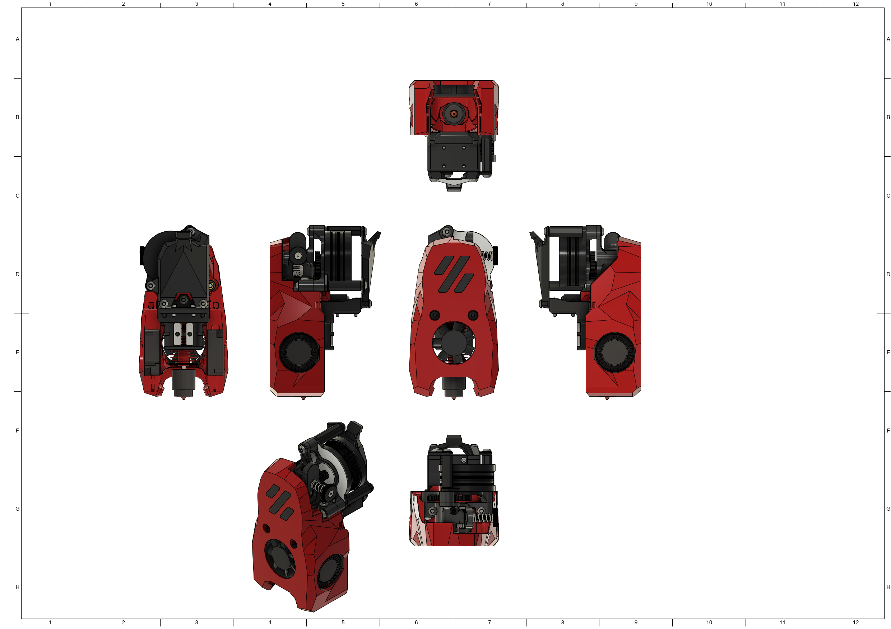
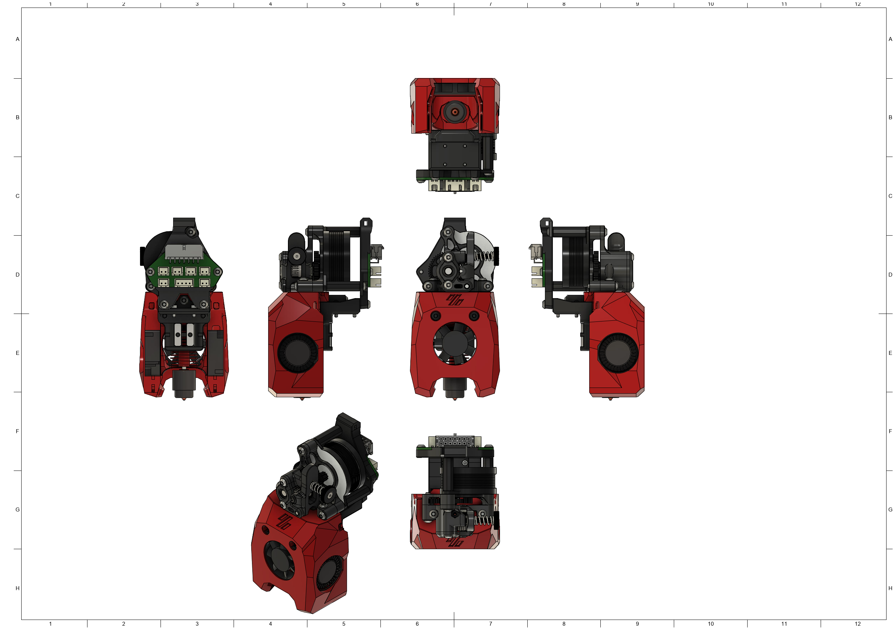

# MiniSB Sherpa Micro

## BOM

| Part                   | Quantity | Notes                                                               |
| ---------------------- | -------- | ------------------------------------------------------------------- |
| M3x5x4 Heatset Insert  | 6        | 
| M3x35 BHCS | 2 | |
| M3x25 BHCS             | 1        |  |
| M3x20 BHCS | 1 | |
| M3x16 BHCS | 1 |
| M3x12 BHCS             | 2        | 
| M3x8 BHCS              | 2        | 
| M3x6 BHCS              | 2        | 
| M3 Hexnut | 1 |
| 3010 Axial Fan | 1 |
| 3010 Blower Fan | 2 |
| Hotend | 1 | There are a number of supported Hotends, check the V0.2 GitHub for options |
| Sherpa Micro Extruder | 1 |
|                        |          |                                                                     |
| **Additional Parts for Umbilical PCB** |          |
| M3x6 BHCS              | 2        | 

## Spacer Sizes

| LDO-Motor                                                     | MOONS-Motor                                                   |
| ------------------------------------------------------------- | ------------------------------------------------------------- |
| 2x [21.85mm](/Spacers/Octagon-STL/Octagon_Spacer_21.85mm.stl) | 2x [21.35mm](/Spacers/Octagon-STL/Octagon_Spacer_21.35mm.stl) |

## Images

### Standard

### Minified

