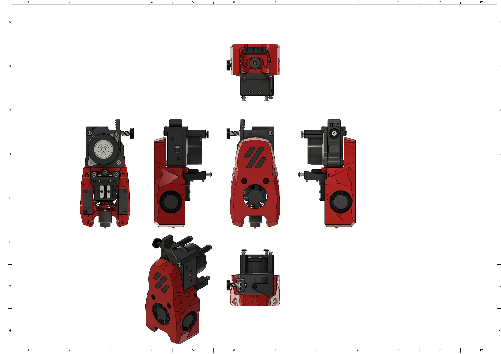
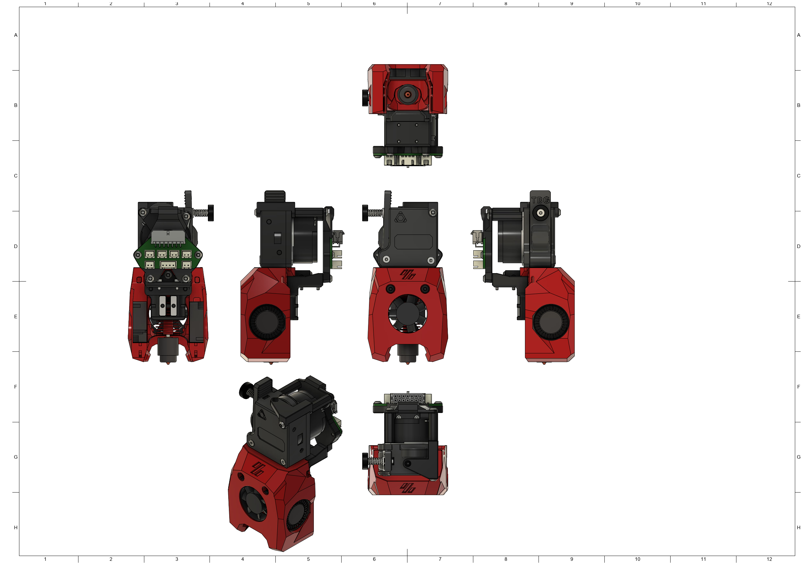

# MiniSB TBG-Lite Left
## PTFE-Holder
The TBG-Lite doesn't hold a PTFE-Reverse Bowden tube by itself, for this the PTFE-Holder is included. Mount by removing the top-right Screw and pushing on the PTFE-Holder and then securing it with a M3x30 BHCS.

The orientation in which the PTFE-Holder is printed makes it crucial that you have good layer adhesion. If you have issues with the part breaking during installation try printing it rotated by 90°, so the PTFE-Hole is at the top and the mounting holes at the bottom.
## BOM
| Part                         | Quantity | Notes                                                        |
|------------------------------|----------|--------------------------------------------------------------|
| M3x5x4 Heatset Insert        | 4        | 
| M3x35 BHCS             | 2        |                                                                            |
| M3x30 BHCS | 1 | Replace Screw for PTFE-Holder
| M3x20 BHCS             | 1        |                                                |
| M3x12 BHCS                   | 3        | 
| M3x8 BHCS                    | 2        | 
| M3x6 BHCS                    | 2        | 
| M3x8 FHCS | 1 | 
| M3 Hexnut              | 1        |
| 3010 Axial Fan         | 1        |
| 3010 Blower Fan        | 2        |
| Hotend                 | 1        | There are a number of supported Hotends, check the V0.2 GitHub for options |
| TBG-Lite Left Extruder   | 1        |
|                        |          |                                                                            |
| **Additional Parts for Umbilical PCB** |        
| M3x6 BHCS                    | 2        | 
## Spacer Sizes
| LDO-Motor | MOONS-Motor |
|-----|-------|
 | 1x [20.35mm](/Spacers/Octagon-STL/Octagon_Spacer_20.35mm.stl), 1x [22.40mm](/Spacers/Octagon-STL/Octagon_Spacer_22.40mm.stl) | 1x [20.35mm](/Spacers/Octagon-STL/Octagon_Spacer_20.35mm.stl), 1x [21.90mm](/Spacers/Octagon-STL/Octagon_Spacer_21.90mm.stl) |

## Images
### Standard

### Minified

