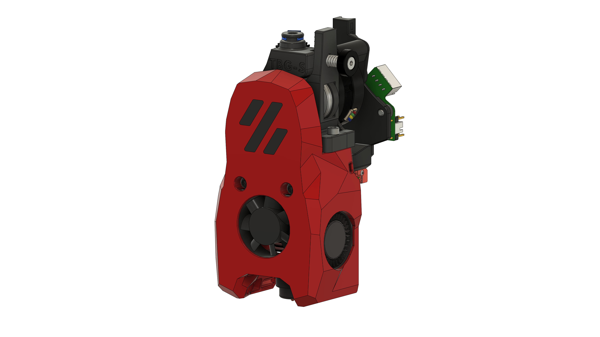
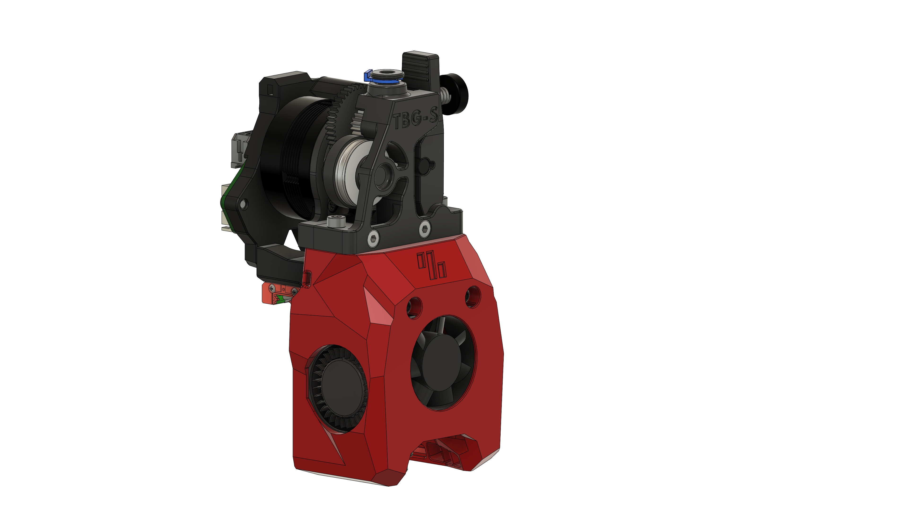

# MiniSB TBG-S

## BOM

| Part                                            | Quantity | Notes                                                                      |
| ----------------------------------------------- | -------- | -------------------------------------------------------------------------- |
| M3x5x4 Heatset Insert                           | 3        |
| M3x35 BHCS                                      | 2        |                                                                            |
| M3x20 BHCS                                      | 1        |                                                                            |
| M3x12 SHCS                                      | 2        | Should be included with the TBG-S Extruder                                 |
| M3x6 BHCS                                       | 1        |
| M3 Hex nut                                      | 1        |
| M2.5x10 SHCS                                    | 1        |
| 3010 Axial Fan                                  | 1        |
| 3010 Blower Fan                                 | 2        |
| Hotend                                          | 1        | There are a number of supported Hotends, check the V0.2 GitHub for options |
| TBG-S Extruder                          | 1        |
|                                                 |          |                                                                            |
| **Additional Parts for standard strain relief** |
| M3x8 BHCS                                       | 2        |                                                                            |
| **Additional Parts for Umbilical PCB**          |
| M3x8 BHCS                                       | 2        |                                                                            |
| M3x6 BHCS                                       | 2        |                                                                            |
| **Additional Parts for CAN Toolheads**          |
| M3x6 BHCS                                       | 4        |                                                                            |

## Images

### Standard

### Minified

## CAD-Source

The source for the CAD-File of the extruder is the [TriangleLab Google Drive](https://drive.google.com/drive/folders/1Wax49gipz4rJb-TFV5nfNy9x6yN46WqA)
