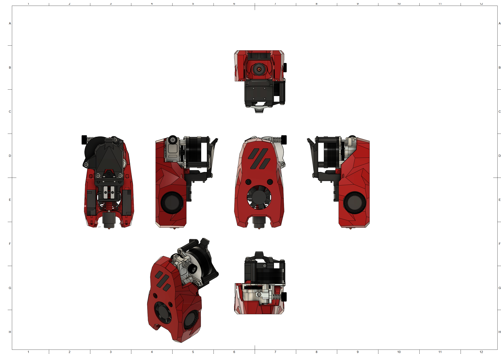
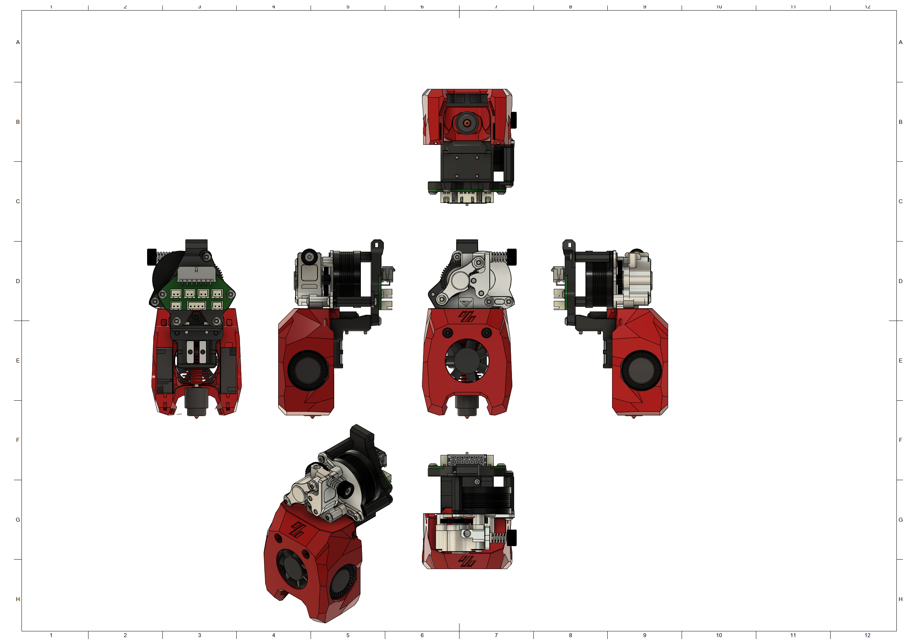

# MiniSB Vz-Hextrudort Low CNC
## BOM
| Part                         | Quantity | Notes                                                        |
|------------------------------|----------|--------------------------------------------------------------|
| M3x5x4 Heatset Insert        | 4        | 
| M3x35 BHCS | 2 | |
| M3x22 BHCS | 1 | M3x25 + M3 Washer also works |
| M3x12 BHCS                   | 2        | 
| M3x8 BHCS                    | 2        | 
| M3x6 BHCS                    | 2        | 
| M3 Hexnut | 1 |
| 3010 Axial Fan | 1 |
| 3010 Blower Fan | 2 |
| Hotend | 1 | There are a number of supported Hotends, check the V0.2 GitHub for options |
| Vz Hextrudort Low CNC Extruder | 1 |
|                              |          |                                                              |
| **Additional Parts for Umbilical PCB** |
| M3x6 BHCS                    | 2        |         |
## Spacer Sizes
| LDO-Motor | MOONS-Motor |
|-----|-------|
| 2x [22.20mm](/Spacers/Octagon-STL/Octagon_Spacer_22.20mm.stl) | 2x [21.70mm](/Spacers/Octagon-STL/Octagon_Spacer_21.70mm.stl) |

## Images
### Standard

### Minified

