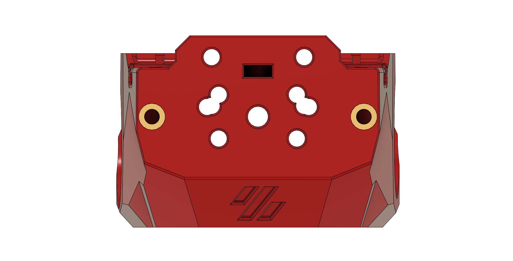

# One Fits Most Mount a.k.a. Swiss Cheese
This is a variant of the Minified Cowling that allows you to mount many extruders while having to print very few files.

The Cowling itself supports the Sherpa Mini, Libra Mini, TBG-Lite Left and Right, the Vz-Hextrudort Low CNC and the LGX Lite. The Sherpa Micro and Orbiter v2.0 can be used by printing an adapter plate each.

## BOM
For the needed parts check the README in the "standard" folder of each extruder.

You will only need additional parts if you need an adapter plate, in which case you will need an additional 6 Heatsets and 4 M3x12 BHCS.

Also keep in mind that if you need an adapter plate that your PTFE-Tube has to be 6 mm longer.