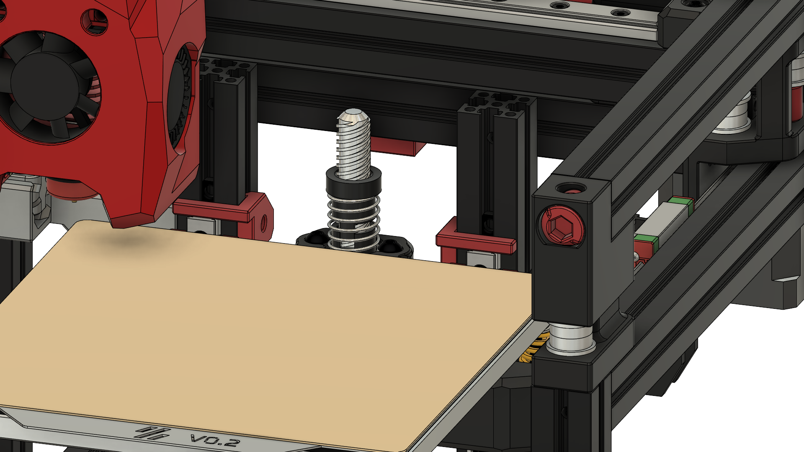
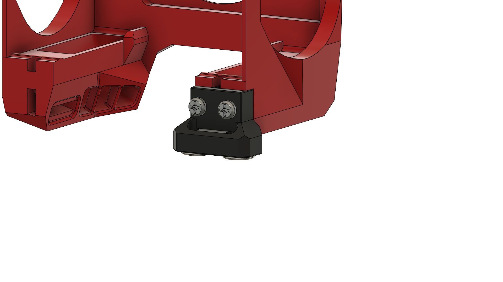
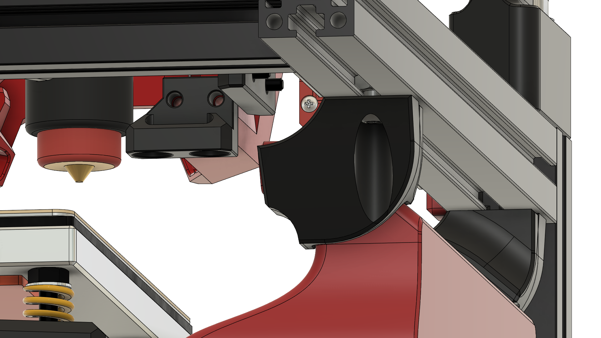

# ZeroClick for Mini-Stealthburner

This is a custom implementation of ZeroClick. The only unchanged part is the probe.
This was done to achieve the following goals:

- Clearance of the mount to avoid collisions
- Allow the use of 2 Sequins LEDs

This resulted in a custom Mount that gets attached to the cowling, an adjusted Dock and slim rail stoppers for the z-axis.

[Video of ZeroClick in action](https://github.com/JackJack3231/MiniSB-Extruder-Mounts/issues/4#issuecomment-1911860910)

### Offset Mount

There is an Offset Mount and Dock, which moves the probe right towards the center of the Toolhead. This was made to reduce the amount the mount and probe stick out to the left of the Cowling to make space for other mods, like an [auxiliary fan](https://github.com/JackJack3231/V0-Auxiliary-Fan). However, this moves the mount closer to the heater block and could cause some problems, depending on your Hotend, e.g. Revo Voron should be fine as the heater block is quite small, Dragon Hotend is problematic as there would be very little space between mount and heater block. So use the Offset version at your own risk!

## Printed Parts

To use the ZeroClick Probe you will need to print:

- 1x [ZeroClick_Probe](https://github.com/zruncho3d/ZeroClick/blob/main/STLs/ZeroClick_Probe.stl) from the original repo. Consider printing 1 or 2 extra in case they break during assembly.
- 1x [ZeroClick_Mount](STL/ZeroClick_Mount_x1.stl) or [ZeroClick_Mount_Offset](STL/ZeroClick_Mount_Offset.stl). Consider printing 1 or 2 extra in case they break during assembly.
- 1x [ZeroClick_Dock_Center](STL/ZeroClick_Dock_Center.stl) or [ZeroClick_Dock_Center_Offset](STL/ZeroClick_Dock_Center_Offset.stl). The Docking position of the probe was adjusted 1.65 mm forward, so the original dock is most likely incompatible.
- 1x [Z_RailStopper_Slim_SingleSided](STL/[a]_Z_RailStopper_Slim_SingleSided.stl) and 1x [Z_RailStopper_Slim_SingleSided_Mirror](STL/[a]_Z_RailStopper_Slim_SingleSided_Mirror.stl).
- 1x Cowling for your Extruder. See the Extruder specific folders for the STL files.

## BOM

The required parts are the same as for standard ZeroClick:

| Part                     | Quantity |
| ------------------------ | -------- |
| M2x10 self-tapping screw | 2        |
| 6x3 mm magnet            | 5        |
| Omron D2F microswitch    | 1        |
| M3x6 BHCS                | 3        |
| M3 Nut                   | 2        |
| Solder wick, wire        |          |

Additionally, if you want to use the slim rail stoppers you will need a M3x8 BHCS and a M3 Nut, however these can be reused from the stock rail stoppers.

## Assembly

The assembly process is basically the same as for the original Mod, so follow the [original instructions](https://github.com/zruncho3d/ZeroClick/tree/main?tab=readme-ov-file#instructions).

## Pictures

### Rail Stoppers:

### Mount:

### Offset Mount:

