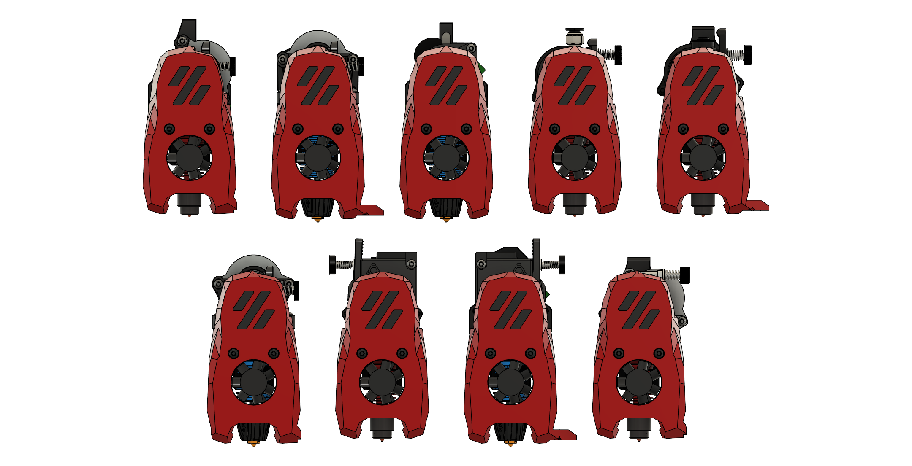
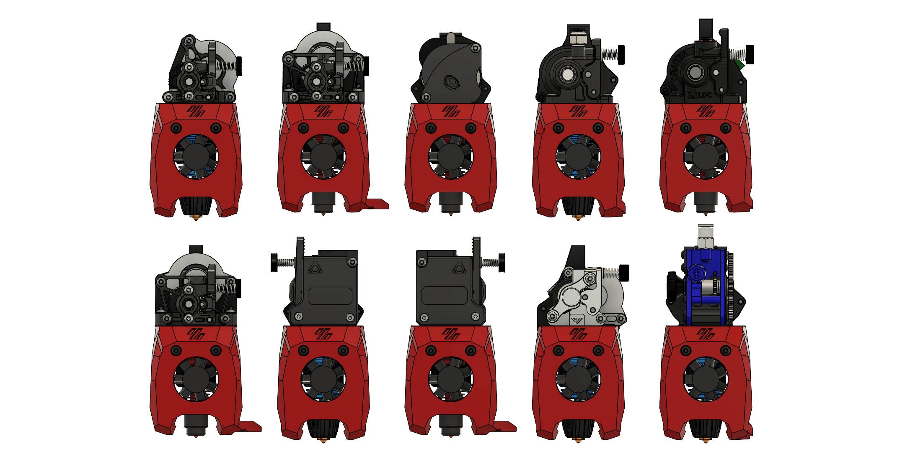

# MiniSB-Extruder-Mounts

Remix of the Mini-Stealthburner to run other Extruders

This repo includes reworked Files of the Mini-Stealthburner to allow you to use diferent Extruders, namely:

- [Phaetus Apus](https://www.phaetus.com/apus/)
- [Mellow Libra Mini](https://www.aliexpress.com/item/1005003506182112.html)
- [Annex Engineering Sherpa Micro](https://github.com/Annex-Engineering/Sherpa_Micro-Extruder)
- [Annex Engineering Sherpa Mini](https://github.com/Annex-Engineering/Sherpa_Mini-Extruder)
- [Orbiter v1.5](https://orbiterprojects.com/orbiter-1-5/)
- [LDO Orbiter v2.0](https://orbiterprojects.com/orbiter-v2-0/)
- Trianglelab TBG-Lite ([Left](https://www.aliexpress.com/item/1005004186141062.html)- and [Right](https://www.aliexpress.com/item/1005003908281100.html)-Version)
- [Vz-Hextrudort Low CNC](https://github.com/VzBoT3D/Vz-HextrudORT)
- [Bondtech LGX-Lite](https://www.bondtech.se/product/lgx-lite-large-gears-extruder/)

The only parts that have changed are the Cowling, Strain-Relief and the Spacers. Everything else is Stock(Hotend-Mount, X-Carriage) so this is a drop-in-replacement for Printers with the V0.2-Style X-Carriage.

As I don't have all of the extruders some are untested, however if the CAD-Files are accurate they should work fine. This table shows the versions i have verified to work (green checkmark):
| Extruder | Standard | Minified |
| -------- | -------- | -------- |
| Phaetus Apus | N/A | :grey_question: |
| Libra Mini | :grey_question: | :grey_question: |
| Sherpa Micro | :heavy_check_mark: | :heavy_check_mark: |
| Sherpa Mini | :heavy_check_mark: | :heavy_check_mark: |
| Orbiter v1.5 | :grey_question: | :grey_question: |
| Orbiter v2.0 | :heavy_check_mark: | :heavy_check_mark: |
| TBG-Lite Left | :heavy_check_mark: | :heavy_check_mark: |
| TBG-Lite Right | :heavy_check_mark: | :heavy_check_mark: |
| Vz-Hextrudort Low CNC | :heavy_check_mark: | :heavy_check_mark: |
| LGX-Lite | :grey_question: | :grey_question: |

## Versions

There are two Versions, a "Standard" and a "Minified" Version. The Standard-Version has the upper Logo-Part of the MiniStealthburner in front of the Extruder (like [Mavericks LGX-Lite Mod](https://mods.vorondesign.com/detail/nJmiEHmmiI9woW4PqjQ2dA)). The Minified Version doesn't have this cover and is more in line with the Bowden-Toolhead or [Mini-AfterSherpa](https://github.com/PrintersForAnts/Mini-AfterSherpa).

### One Fits Most Version a.k.a Swiss Cheese
There is a [Version](/Extruder_Mounts/_OneFitsMost/) that aims to support as many extruders as possible, while needing as few printed parts as possible. Dubbed swiss cheese.
## Strain-Relief and Spacers

Also included are Strain-Reliefs (quickly and crappily thrown together) and Mounting Plates for the [Umbilical-PCB by Timmit](https://github.com/VoronDesign/Voron-Hardware/tree/master/V0-Umbilical).

The needed Spacers (Size according to CAD) are also included, both in the standard round shape and a octagon version inspired by [KayosMaker](https://github.com/KayosMaker/CANboard_Mounts). The Octagon Spacers are the preferred version, because these don't rely on layer-adhesion for their strength and can be printed lying down instead. Also note that depending on which motor you have on your extruder the Spacer-Length can change because Moons-Motors have a thicker Mounting-Flange (2.5mm) compared to LDO (2mm). Keep in mind, when installing the Heatsets into the spacers they can get squished, so the alignment is not 100% correct anymore. If you have issues with this try using longer spacers.

## Print-Instructions

Standard Voron Print-Settings (0.2mm Layer Height, 4 Perimeters, 40% Infill, 5 Top- and Bottom-Layers). No Supports are needed and all STLs are oriented the correct way and ready to import and print.

## Assembly

Pretty much all of the mounts get assembled the same way, important differences get called out in the mount-specific Assembly Manual:

1. Install Heatset-Inserts into Spacers, if your Extruder gets screwed down from the top also install Heatsets into the Cowling
2. Install Fans according to [V0.2 Assembly Manual](https://github.com/VoronDesign/Voron-0/blob/Voron0.2/Manuals/VORON_V0.2_Assembly_Manual.pdf) (page 165-167)
3. Insert the M3 Hex-Nut into the slot on the top of the cowling
4. Secure Extruder to the Cowling with hardware mentioned in the mount-specific BOM
5. Install Hotend, make sure to cut the PTFE-Tube to the correct length.
6. Install everything to the X-Carriage, secure with 2 M3x35 BHCS from the front and 1 M3x20 BHCS from the rear
7. Add Spacers for strain-relief/umbilical plate, you may need to replace some screws to have enough thread to engage with the spacers
8. Add strain-relief/umbilical plate, secure to spacers and X-Carriage
## Credits

The files have been remixed from [Mavericks LGX-Lite Mod](https://mods.vorondesign.com/detail/nJmiEHmmiI9woW4PqjQ2dA). CAD-Files are included as well as Base-CAD-Files so you can easily create a Version for your Extruder.

## Extras

There are Toolhead-Pictures for the Mainsail sidebar included in the Extras Folder.

# Changelog
## 2023-08-17
- Added LGX-Lite Mounts. As Maverick hasn't updated the original Mod to the R1 ducts, I decided to add updated LGX-Lite Mounts to this repo. This includes Strain Relief, Umbilical Plate and a Minified Version.
- Added small hexagonal shape to the rear of the cowling. This makes it slot into the X-Carriage even more, thanks [@probably-Erwins-Cat](https://github.com/probably-Erwins-Cat) for pointing that out. Closes [#3](https://github.com/JackJack3231/MiniSB-Extruder-Mounts/issues/3)
- Moved Hexnut in the cowling back 2mm so now a M3x20 BHCS can be used to secure the cowling from the back instead of a M3x22.

## 2023-07-29: 
- Update Rapido Cowlings to use R1-style part-cooling-ducts (a bit ugly but should work pretty well)
- Add Dragon UHF Mount, as it should work just like the Rapido HF
- Update One Fits Most Version to use R1 part-cooling-ducts (missed that last time)

## 2023-06-13: 
- Update Cowling ducts to the improved ones from the [V0.2r1 Release](https://github.com/VoronDesign/Voron-0#v02r1-2023-june). Rapido Cowlings are using the old ducts for now.

## 2023-06-06: 
- Add Experimental Rapido HF Cowlings based on [Mavericks mod](https://mods.vorondesign.com/detail/dWZjGJ83RbTpRTdYYRwng).